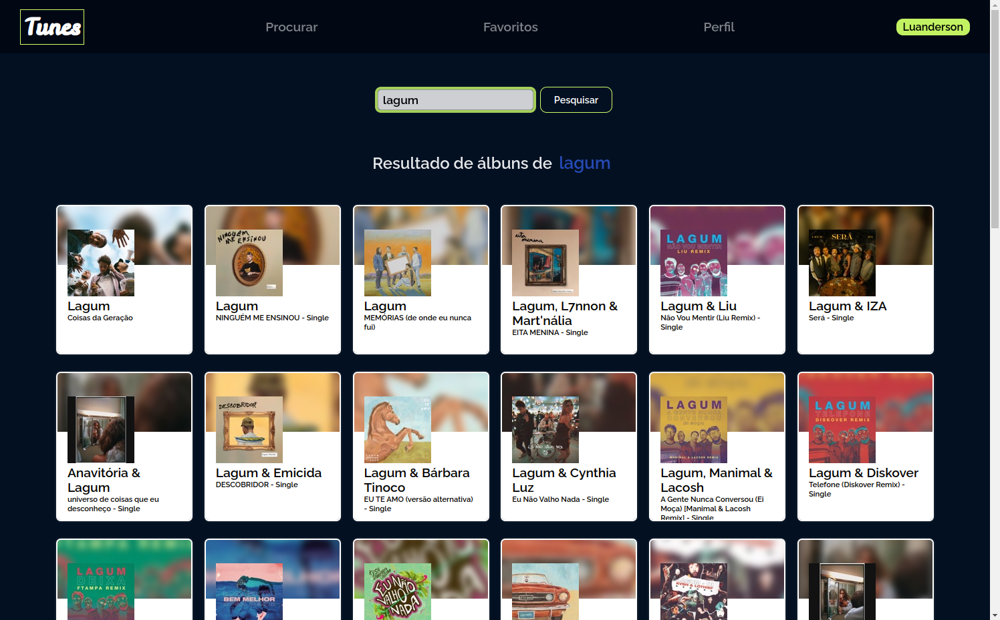

># Tunes

## Projeto completo! (CSS em construção)

## Sobre o projeto
        A aplicação "Tunes" é um buscador de músicas vindo da API da iTunes da Apple. Feita em React
        usando o React Router Dom e estilizalção em CSS puro. A API retorna um preview de 29 segundos
        de música.
        Na aplicação o usuário consegue buscar por um artista ou álbum específico, favoritar suas
        músicas preferidas para quando quiser ir ver a lista de todas as músicas favoritadas, 
        editar seu perfil mudando o nome, adicionando um email, a descrição e uma foto.

># 🔗 [Acesse clicando aqui!](https://luandersonalvesdev.github.io/tunes/#/)

## 👨‍💻 APRENDIZADO
- Consumo de dados de `API`.
- Ciclos de vida de um componente.
- Utilização do `BrowserRouter` corretamente.
- Criação de rotas com o `Route`.
- Utilização do `Switch` do `React Router`.
- Criação de links de navegação com o `Link`.

## 🛠️ FERRAMENTAS USADAS 
- React
- React Router Dom

## CONTATO

https://linkedin.com/in/luandersonalvesdev